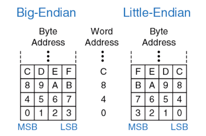
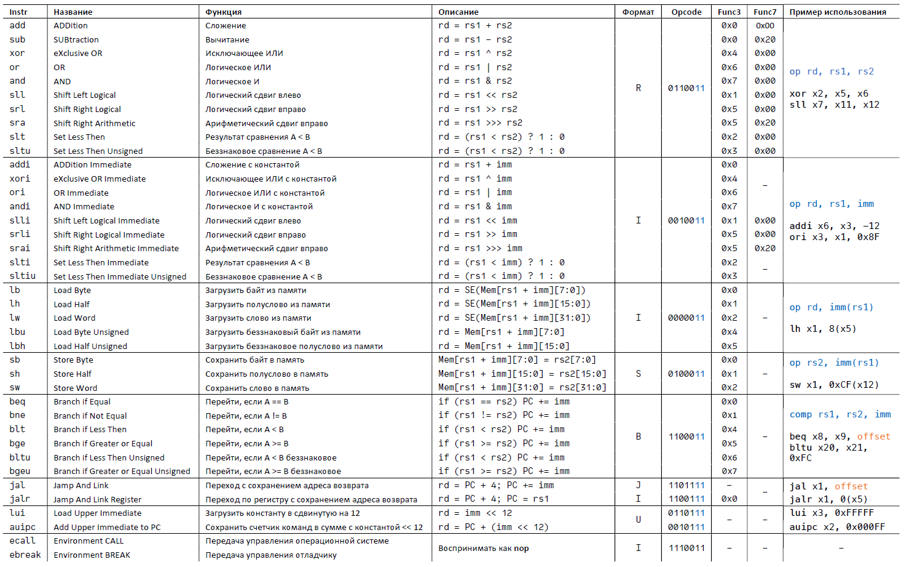

# Лекция 6. Архитектура RISC-V

[СОДЕРЖАНИЕ](../README.md)

Лекция была посвящена обзору архитектуры RISC-V и ее особенностей.


text text



sf



```assembly
add x1, x1, x0
sub t0, t2, t1
```


### Основные материалы лекции

1. [Ссылка](https://www.youtube.com/watch?v=wMhUfqiBj5M) на видеозапись лекции
2. Все материалы лекции можно найти в этом источнике, к сожалению аналога на русском пока не нашел [***Patterson Hennessy***. *Computer organization and design. RISC-V edition* — 2 глава] 

### Дополнительные материалы к лекции для саморазвития

1. Понятный разбор очень похожей архитектуры MIPS [***Харрис и Харрис***. *Цифровая схемотехника и архитектура компьютера* — параграфы 6.1, 6.2]
2. Еще один годный разбор другой популярной RISC архитекрутры — ARM [***Харрис и Харрис***. *Цифровая схемотехника и архитектура компьютера. Дополнение по архитектуре ARM* — параграфы 1.1, 1.2]
3. Обзор популярной тройки: x86, ARM, AVR [***Таненбаум и Остин***. *Архитектура компьютера* — Глава 5]

### Популярные материалы

1. На [этом](https://www.kvakil.me/venus/) сайте можно сразу писать код на языке ассемблера RISC-V, запускать, отлаживать, а потом еще и машинный код сохранить себе
2. [Расширение](https://marketplace.visualstudio.com/items?itemName=hm.riscv-venus) для VSCode ассемблера и дебаггера RISC-V
3. Немного [мёда](https://www.terraelectronica.ru/news/6423) про RISC-V
4. Отличнейшая популярная книга о цифровой схемотехнике и архитектуре компьютера, рекомендую заглянуть в нее при любом уровне понимания материала. Объем не большой, страницы маленькие, буквы большие, за пару полных вечеров вполне читается, многое проясняет и ставит на место [***Чарльз Петцольд***. *Код. Тайный язык информатики*] 

