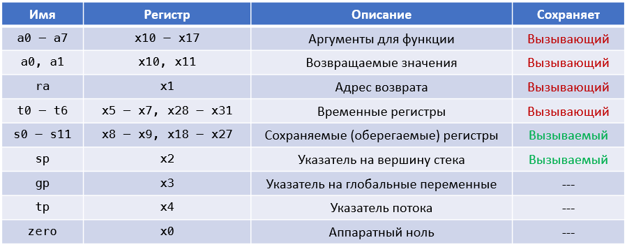

# Лекция 7. Программирование RISC-V

[СОДЕРЖАНИЕ](../README.md)

g

sd

### Основные материалы лекции

1. [Ссылка](https://www.youtube.com/watch?v=y1mNFvm8OZY) на видеозапись лекции
2. Все материалы лекции можно найти в этом источнике, к сожалению аналога на русском пока не нашел [***Patterson Hennessy***. *Computer organization and design. RISC-V edition* — 2 глава] 

### Дополнительные материалы к лекции для саморазвития

1. [Полезная информация](https://github.com/riscv/riscv-asm-manual/blob/master/riscv-asm.md) по программированию на языке ассемблера RISC-V, на английском языке
2. [Здесь](http://skilldrick.github.io/easy6502/) можно познакомиться, разобраться и пописать ассемблерные программки под архитектуру 6502 — классический процессор, на котором работают Бендер, Терминатор и Денди. Давай-давай, не стесняйся, заходи. Прямо на странице есть встроенный симулятор и объясняют как написать простенькую игру — змейку. Если не в курсе, люди соревнуется, у кого она получится меньше по объему кода. Да и вообще в интернете полно информации по этому процессору. Процитирую автора  ресурса: 6502 is *fun*. Nobody ever called x86 *fun*. А [тут](https://museum.netstalking.ru/xaknotdie/02_nes_6502_asm.html) на русском про программирование 6502.

### Популярные материалы

1. В [этом](https://godbolt.org/) онлайн-компиляторе можно смотреть в какую последовательность ассемблерных инструкций скомпилируется твой код на C++ для самых разных архитектур. Можно, например, сравнить x86, ARM и RISC-V, при том разных версий компиляторов — чем отличается генерируемые инструкции процессору в каждом случае, где код длиннее, где требуется много подготовительных операций и тому подобное. В конце концов наглядно посмотреть разницу между программами для CISC и RISC архитектур

